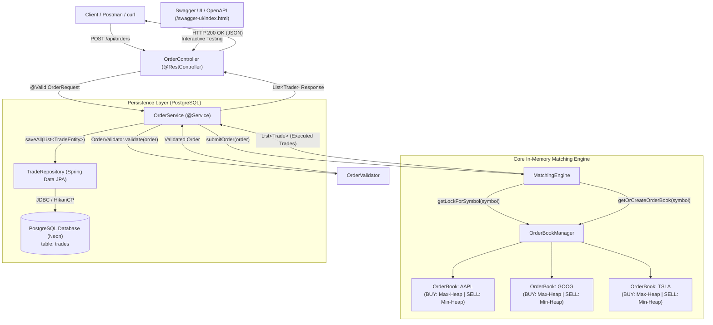
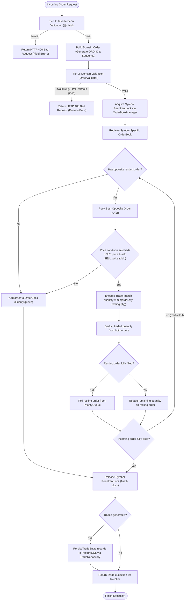

# ApexMatch Architecture Documentation

## 1. Project Purpose

ApexMatch is a high-performance, real-time stock order matching engine developed with Java 21 and Spring Boot 3.5.x. The system simulates the core backend processing logic of an electronic financial exchange.

The exchange itself is not a counterparty; it does not buy or sell securities for its own account. Instead, it acts as an impartial facilitator that receives incoming BUY and SELL orders from market participants, matches compatible counter-orders according to strict **Price-Time Priority (FIFO)**, and emits immutable trade execution records.

---

## 2. High-Level Architecture & Request Flow

The complete end-to-end request lifecycle follows a strict layered architecture:

```text
Client (HTTP / Swagger UI)
       │
       │ HTTP POST /api/orders (JSON payload)
       ▼
[OrderController]              ─── Web Layer (DTO validation & REST endpoint)
       │
       │ OrderRequest DTO
       ▼
[OrderService]                 ─── Service Orchestration Layer (ID & sequence generation)
       │
       │ Domain Order (validated)
       ▼
[MatchingEngine]               ─── Core Matching Engine (Intra-symbol synchronization)
       │
       │ Symbol normalization & lock acquisition
       ▼
[OrderBookManager]             ─── Multi-Symbol Registry (ConcurrentHashMap)
       │
       │ Dedicated OrderBook
       ▼
[Symbol OrderBook]             ─── In-Memory Order Book (Dual PriorityQueues)
       │
       │ Executed List<Trade>
       ▼
[OrderService]                 ─── Persistence Coordinator
       │
       │ List<TradeEntity>
       ▼
[TradeRepository]              ─── Spring Data JPA Persistence
       │
       │ SQL INSERT
       ▼
[PostgreSQL Database]          ─── Durable Relational Storage (Neon)
```

---

## 3. High-Level Architecture Diagram



---

## 4. Order Matching Decision Flow Diagram



---

## 5. Layer Responsibilities

| Layer / Component | Class | Responsibility |
|---|---|---|
| **Web REST API** | `OrderController` | Exposes `POST /api/orders`. Deserializes JSON payloads, triggers Bean Validation via `@Valid`, and maps HTTP response codes. Contains zero business rules. |
| **Exception Handling** | `GlobalExceptionHandler` | `@RestControllerAdvice` mapping validation failures (`MethodArgumentNotValidException`), domain violations (`IllegalArgumentException`), and unparseable JSON (`HttpMessageNotReadableException`) to structured HTTP `400 Bad Request` responses. |
| **Service Orchestration** | `OrderService` | Generates unique IDs (`ORD-N`) and sequence numbers. Validates domain orders via `OrderValidator`. Orchestrates execution with `MatchingEngine` and coordinates trade persistence. |
| **Domain Validation** | `OrderValidator` | Enforces financial and domain constraints: LIMIT orders must specify positive prices; MARKET orders must omit prices. |
| **Matching Engine** | `MatchingEngine` | Coordinates intra-symbol order execution, evaluates price-time matching, executes partial fills, and manages per-symbol `ReentrantLock` acquisition and release. |
| **Multi-Symbol Registry** | `OrderBookManager` | Thread-safe registry (`ConcurrentHashMap`) maintaining dedicated `OrderBook` instances and dedicated `ReentrantLock` instances per trading symbol. Normalizes ticker symbols (trimmed uppercase). |
| **In-Memory Order Book** | `OrderBook` | Manages dual binary heaps (`PriorityQueue`): max-heap for BUY orders and min-heap for SELL orders. Implements $O(1)$ peek and $O(\log n)$ insertion/removal. |
| **Persistence Layer** | `TradeRepository` & `TradeEntity` | Spring Data JPA repository mapping domain trade executions to the relational `trades` PostgreSQL table. |

---

## 6. In-Memory Trading State vs. Persistent State

A fundamental architectural design decision in ApexMatch is the strict separation between **in-memory trading state** and **persistent relational state**:

```text
┌──────────────────────────────────────────────┐       ┌──────────────────────────────────────────────┐
│           In-Memory Trading State            │       │               Persistent State               │
├──────────────────────────────────────────────┤       ├──────────────────────────────────────────────┤
│ • OrderBook (dual PriorityQueues)            │       │ • TradeEntity records                        │
│ • Resting active orders                      │       │ • PostgreSQL relational database (Neon)      │
│ • Sequence numbers & price-time queues       │       │ • Permanent audit log & transaction history  │
│ • Microsecond matching execution             │       │ • Millisecond disk I/O & ACID durability     │
└──────────────────────────────────────────────┘       └──────────────────────────────────────────────┘
```

### Why Active OrderBooks are Kept In-Memory
1. **Ultra-Low Latency**: Financial exchanges operate in microseconds. Dual-heap memory operations (pointer manipulation and binary heap rebalancing) execute in under a microsecond, whereas relational database round-trips (disk I/O, WAL logging, table locks) take milliseconds.
2. **Preventing SQL Lock Contention**: Managing an active order book in relational tables (`SELECT ... ORDER BY price, sequence LIMIT 1 FOR UPDATE`) causes severe row-lock contention, deadlocks, and serialization bottlenecks under concurrent order arrival.
3. **Queue Sorting Efficiency**: Java's `PriorityQueue` maintains ordered heaps with $O(1)$ best-bid/ask peek and $O(\log n)$ insertion. Databases require continuous index re-sorting and table scans.

### Why Trades are Persisted to PostgreSQL
1. **Permanent Audit Trail**: Once matched, trades are immutable financial records that must survive application restarts and system failures.
2. **Post-Trade Compliance & Reporting**: Relational databases excel at historical auditing, aggregations, tax reporting, and balance reconciliation.
3. **Decoupled Durability**: Trades are persisted after matching succeeds. This ensures that while matches happen in memory at millions of operations per second, trade history is reliably preserved in PostgreSQL.

---

## 7. Concurrency & Thread-Safety Model

ApexMatch uses **partitioned, per-symbol concurrency** backed by Java `ReentrantLock`:
- **Fine-Grained Locking**: Each symbol (`AAPL`, `GOOG`, `TSLA`) has its own independent `ReentrantLock` inside `OrderBookManager`.
- **Zero Cross-Symbol Contention**: Concurrent orders for different symbols execute in parallel across CPU cores without blocking each other.
- **Strict Intra-Symbol Safety**: Multiple threads submitting orders for the *same* symbol acquire that symbol's lock sequentially, guaranteeing thread-safe mutations on the underlying `PriorityQueue` structures.
- **Guaranteed Release**: All lock acquisitions are paired with `try / finally` blocks to ensure locks are unconditionally released even if an unexpected runtime exception occurs.
